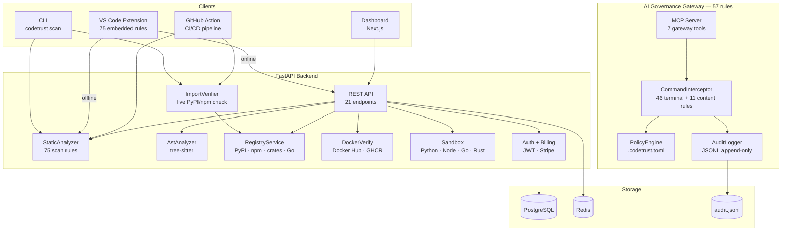

<p align="center">
  
</p>

<p align="center">
  <strong>Trust the code. Ship with proof.</strong>
</p>

<p align="center">
  <a href="https://pypi.org/project/codetrust/"></a>
  <a href="https://marketplace.visualstudio.com/items?itemName=SaidBorna.codetrust"></a>
  <a href="LICENSE"></a>
  <a href="https://github.com/S-Borna/codetrust/actions"></a>
</p>

<p align="center">
  <a href="https://codetrust.saidborna.com">Website</a> &middot;
  <a href="https://pypi.org/project/codetrust/">PyPI</a> &middot;
  <a href="https://marketplace.visualstudio.com/items?itemName=SaidBorna.codetrust">VS Code</a> &middot;
  <a href="https://github.com/S-Borna/codetrust">GitHub</a> &middot;
  <a href="CHANGELOG.md">Changelog</a>
</p>

---

## What is CodeTrust?

**AI code safety platform** — 132 rules across 10 enforcement layers. Three capabilities no linter has:

1. **AI Governance Gateway** — 57 real-time interception rules that block destructive AI agent actions *before execution*
2. **Live Import Verification** — extracts imports and verifies every package against PyPI/npm. Catches hallucinated packages automatically
3. **AI Trust Score** — tracks how safe your AI-generated code is over time, with baseline trending and delta tracking

CLI, GitHub Action, MCP server, and VS Code extension. Works offline. Works in CI.

### Architecture



---

## What's New in 2.1 — The Three Moats

> Released 13 February 2026 — [Full Changelog](CHANGELOG.md)

### Moat 1: AI Governance Gateway (57 rules)

- **46 terminal rules** across 9 categories — file destruction, code execution,
  privilege escalation, git ops, container escape, network exfiltration,
  secrets, supply chain, resource abuse
- **11 content rules** — secrets, private keys, SSL bypass, CORS, eval, pickle, debug mode
- Blocks destructive AI actions *before* they execute

### Moat 2: Live Import Verification

- `codetrust scan .` now **verifies every import against PyPI/npm** automatically
- Hallucinated packages → BLOCK finding with exact file + line number
- `--no-verify-imports` to skip
- Also runs in GitHub Action — annotations in PR diffs

### Moat 3: AI Trust Score with Trending

- AI Trust sub-score penalizes hallucination findings 15x
- Baseline stored in `.codetrust/drift_baseline.json`
- Delta tracking: shows improvement/regression between runs
- A+ grade curve: A+/A/B+/B/C+/C/D/F
- Trend analysis: improving/degrading/stable

### Also new

- **132 total rules** — 75 scan + 57 gateway (was 82)
- **1312 tests** — 0 failures (was 1168)
- **13 AI-specific hallucination rules** (was 5)
- SARIF, project config, SSO/OIDC, GDPR, Helm, SBOM, Prometheus, SIEM, webhooks

---

## 10 Enforcement Layers

| # | Layer | Rules | What It Catches |
|:-:|-------|:-----:|-----------------|
| 01 | **Static Analysis** | 15 | Secrets, `eval`/`exec`, bare `except`, mutable defaults, magic numbers |
| 02 | **Root Cause Analysis** | 4 | Swallowed exceptions, lint suppression, sleep without context, debug mode |
| 03 | **SQL Analysis** | 13 | `SELECT *`, `DELETE` without `WHERE`, `FLOAT` for money, `GRANT ALL` |
| 04 | **AST Analysis** | — | Cyclomatic complexity, unused variables, unreachable code (tree-sitter) |
| 05 | **Container Hardening** | 10 | Root user, `:latest` tags, missing `WORKDIR`, `ENV` secrets, no healthcheck |
| 06 | **IaC & Config** | 7 | Hardcoded IPs, debug mode in config, API keys, unbounded retries |
| 07 | **React & Kubernetes** | 13 | `dangerouslySetInnerHTML`, `privileged: true`, missing resource limits |
| 08 | **Import Verification** | — | **Live PyPI/npm check** — catches hallucinated packages automatically |
| 09 | **Docker Verification** | — | Verify base images and tags against Docker Hub / GHCR |
| 10 | **AI Governance Gateway** | 57 | **Real-time interception** — blocks destructive AI actions before execution |

---

## AI Governance Gateway (Moat 1)

The Gateway intercepts AI agent actions **before execution** — not just scanning files after the fact. It sits between the AI model and the tools, validating every terminal command, file write, and package install against configurable policies.

**57 rules across 9 categories:**

```
AI Model → Gateway (validate) → Allow/Block → Execute
                ↓
           Audit Log (.codetrust/audit.jsonl)
```

### What It Blocks

| Category | Rules | Examples |
|----------|:-----:|---------|
| File Destruction | 5 | `rm -rf /`, `shred`, `dd of=/dev/` |
| Code Execution | 7 | `eval`, `curl\|sh`, heredoc, `python -c` |
| Privilege Escalation | 5 | `chmod 777`, `sudo su`, `chown root` |
| Git Operations | 3 | `git push`, `git push --force`, `git reset --hard` |
| Container Escape | 4 | `--privileged`, `--pid=host`, `--net=host` |
| Network Exfiltration | 5 | `curl POST`, `nc`, `scp`, DNS tunneling |
| Secrets Exposure | 6 | `export API_KEY`, `.env` cat, AWS credentials |
| Supply Chain | 6 | `pip install --index-url`, `npm set registry` |
| Resource Abuse | 5 | Fork bomb, `stress`, `crypto-miner` |
| Content Rules | 11 | Hardcoded secrets, private keys, pickle, eval in files |

All rules are **configurable** — users can disable any rule via `.codetrust.toml`.

### Setup

```bash
# Install governance config
codetrust init

# Add gateway to Claude Desktop
codetrust governance --setup

# Check status
codetrust governance --status

# View audit log
codetrust audit --hours 24
```

### Configuration

```toml
# .codetrust.toml
[codetrust.governance]
enabled = true
mode = "enforce"    # enforce | audit | off

[codetrust.governance.terminal]
block_heredoc = true
block_eval = true
block_git_push = true
# Set any to false to disable

[codetrust.governance.files]
protected_paths = ["LICENSE", ".env"]

[codetrust.governance.audit]
enabled = true
path = ".codetrust/audit.jsonl"
```

---

## Quick Start

### Installation

```bash
# PyPI (CLI + MCP server + API)
pip install codetrust

# VS Code Extension (offline scanning, no server required)
code --install-extension SaidBorna.codetrust

# From source
git clone https://github.com/S-Borna/codetrust.git && cd codetrust
pip install -e ".[dev]"
```

### Scan a Project

```bash
# Scan a file
codetrust scan app.py

# Scan a directory
codetrust scan src/

# Output SARIF for CI/CD
codetrust scan src/ --sarif --sarif-file results.sarif
```

### Project Configuration

Create `.codetrust.toml` in your project root:

```toml
[codetrust]
exclude_paths = ["migrations/", "vendor/", "*.generated.py"]
ignore_rules = ["sql_todo_hack", "sql_no_index_hint"]

[codetrust.severity_overrides]
magic_number = "INFO"
hardcoded_ip = "BLOCK"
```

Or add to your existing `pyproject.toml`:

```toml
[tool.codetrust]
exclude_paths = ["migrations/"]
ignore_rules = ["sql_todo_hack"]
```

---

## Supported Languages

| Language | Static | AST | Extensions |
|----------|:------:|:---:|------------|
| Python | Yes | Yes | `.py` |
| JavaScript | Yes | Yes | `.js`, `.jsx` |
| TypeScript | Yes | Yes | `.ts`, `.tsx` |
| Go | Yes | Yes | `.go` |
| Rust | Yes | Yes | `.rs` |
| SQL | Yes | — | `.sql` |
| Dockerfile | Yes | — | `Dockerfile` |
| YAML / CI | Yes | — | `.yml`, `.yaml` |

---

## Distribution

| Channel | Install | Status |
|---------|---------|:------:|
| **PyPI** | `pip install codetrust` | Live |
| **VS Code Marketplace** | `code --install-extension SaidBorna.codetrust` | Live |
| **GitHub Action** | `uses: S-Borna/codetrust@v2` | Live |
| **Cloud API** | `https://codetrust-api-production.up.railway.app` | Live |
| **MCP Server** | `python -m src.server` | Live |
| **Website** | [codetrust.saidborna.com](https://codetrust.saidborna.com) | Live |

---

## GitHub Action

```yaml
- uses: S-Borna/codetrust@v2
  with:
    fail-on: block           # block | warn | never
    scan-type: static        # static | deep
    sarif: true              # emit SARIF for Code Scanning
  env:
    CODETRUST_API_KEY: ${{ secrets.CODETRUST_API_KEY }}

# Upload SARIF results
- uses: github/codeql-action/upload-sarif@v3
  if: always()
  with:
    sarif_file: codetrust-results.sarif
```

---

## MCP Server (Claude Code)

Add to `~/.claude/claude_desktop_config.json`:

```json
{
  "mcpServers": {
    "codetrust": {
      "command": "python",
      "args": ["-m", "src.server"],
      "cwd": "/path/to/codetrust"
    },
    "codetrust-gateway": {
      "command": "python",
      "args": ["-m", "src.gateway.server"],
      "cwd": "/path/to/codetrust"
    }
  }
}
```

### MCP Tools

| Tool | Server | Description |
|------|--------|-------------|
| `codetrust_static_scan` | Scanner | Scan code for anti-patterns and security issues |
| `codetrust_pre_action` | Scanner | Validate plan before writing code |
| `codetrust_post_action` | Scanner | Validate completed work against enterprise standards |
| `codetrust_list_rules` | Scanner | List all rules and their severities |
| `codetrust_verify_imports` | Scanner | Verify package imports exist in real registries |
| `codetrust_verify_dockerfile` | Scanner | Verify Docker base images and tags |
| `codetrust_deep_scan` | Scanner | Run all validation layers in a single pass |
| `codetrust_validate_command` | Gateway | Validate terminal command before execution |
| `codetrust_validate_file_write` | Gateway | Validate file content before writing |
| `codetrust_validate_file_delete` | Gateway | Validate file deletion |
| `codetrust_validate_package` | Gateway | Validate package name before install |
| `codetrust_governance_status` | Gateway | Show governance config and policy status |
| `codetrust_audit_history` | Gateway | Query governance audit log |
| `codetrust_list_gateway_rules` | Gateway | List all gateway interception rules |

---

## HTTP API

All endpoints require `X-API-Key` header when `CODETRUST_API_KEY` is set.

| Method | Path | Description |
|--------|------|-------------|
| `GET` | `/v1/status` | Health check — version, cache status |
| `POST` | `/v1/scan/static` | Static anti-pattern scan |
| `POST` | `/v1/scan/deep` | Full deep scan (all layers) |
| `POST` | `/v1/verify/imports` | Verify package imports |
| `POST` | `/v1/verify/dockerfile` | Verify Docker images and tags |

```bash
# Quick test
curl https://codetrust-api-production.up.railway.app/v1/status
```

---

## Configuration

### Environment Variables

| Variable | Default | Description |
|----------|---------|-------------|
| `CODETRUST_HOST` | `0.0.0.0` | API bind host |
| `CODETRUST_PORT` | `8000` | API bind port |
| `CODETRUST_API_KEY` | — | API authentication key |
| `CODETRUST_REDIS_URL` | `redis://localhost:6379` | Redis cache URL |
| `CODETRUST_HTTP_TIMEOUT` | `10.0` | HTTP client timeout (seconds) |
| `CODETRUST_DEBUG` | `false` | Debug mode |

### VS Code Extension Settings

| Setting | Default | Description |
|---------|---------|-------------|
| `codetrust.apiUrl` | Cloud URL | API server URL |
| `codetrust.apiKey` | — | API key |
| `codetrust.scanOnSave` | `true` | Auto-scan on save |
| `codetrust.severityThreshold` | `INFO` | Minimum severity |
| `codetrust.scanType` | `static` | `static` or `deep` |

---

## Architecture

```
+----------------------------------------------+
|      VS Code Extension  .  CLI  .  Action    |
|          (67 rules, offline-capable)          |
+-------------------+--------------------------+
                    |
+-------------------v--------------------------+
|        AI Governance Gateway (MCP)           |
|   Intercept . Validate . Audit . Block       |
+-------------------+--------------------------+
                    |
+-------------------v--------------------------+
|           MCP Server  .  HTTP API            |
|      7 tools  .  5 endpoints  .  auth        |
+-------------------+--------------------------+
                    |
+-------------------v--------------------------+
|              Services Layer                  |
|  StaticAnalyzer . AST . Registry . Docker    |
|  Billing . Auth . Rate Limiting . Sandbox    |
+-------------------+--------------------------+
                    |
+-------------------v--------------------------+
|    PostgreSQL  .  Redis Cache  .  Stripe     |
+----------------------------------------------+
```

---

## Development

```bash
pip install -e ".[dev]"
pytest tests/ -v           # 1312 tests
ruff check src/ tests/     # zero warnings
cd extension && npx tsc --noEmit   # TypeScript
```

---

## License

Proprietary — Copyright (c) 2026 Said Borna. All rights reserved. See [LICENSE](LICENSE).
