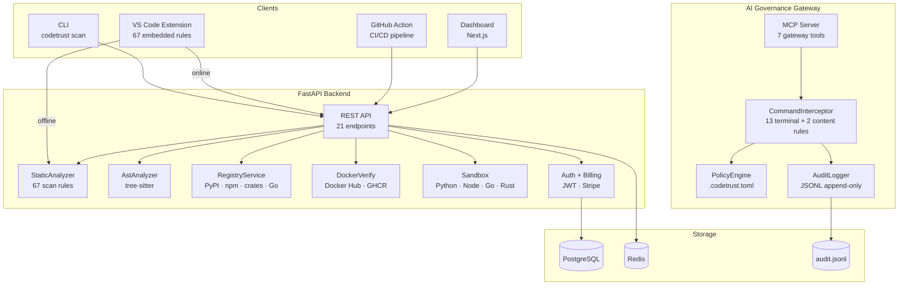

<p align="center">
  
</p>

<p align="center">
  <strong>Trust the code. Ship with proof.</strong>
</p>

<p align="center">
  <a href="https://pypi.org/project/codetrust/"></a>
  <a href="https://marketplace.visualstudio.com/items?itemName=SaidBorna.codetrust"></a>
  <a href="LICENSE"></a>
  <a href="https://github.com/S-Borna/codetrust/actions"></a>
</p>

<p align="center">
  <a href="https://codetrust.saidborna.com">Website</a> &middot;
  <a href="https://pypi.org/project/codetrust/">PyPI</a> &middot;
  <a href="https://marketplace.visualstudio.com/items?itemName=SaidBorna.codetrust">VS Code</a> &middot;
  <a href="https://github.com/S-Borna/codetrust">GitHub</a> &middot;
  <a href="CHANGELOG.md">Changelog</a>
</p>

---

## What is CodeTrust?

AI code governance and verification platform — 82 rules across 10 enforcement layers (67 scan + 15 gateway). Verifies dependencies, containers, and infrastructure against real registries. Prevents hallucinated packages, unsafe patterns, and CI/CD failures before production. Includes pre-execution AI governance gateway, MCP server, CLI, and VS Code extension.

### Architecture



---

## What's New in 2.0

> Released 13 February 2026 — [Full Changelog](CHANGELOG.md)

- **82 total rules** — 67 scan rules (56 regex + 11 file-level) + 15 gateway rules
- **React / JSX scanning** — `dangerouslySetInnerHTML`, `innerHTML`, missing `key`, direct DOM access, `useEffect` without deps, `setState` in render, index-as-key
- **Kubernetes scanning** — `privileged: true`, `hostNetwork`, `hostPID`, `runAsUser: 0`, missing resource limits, `:latest` tag
- **SARIF output** — `codetrust scan --sarif` emits SARIF v2.1.0 for GitHub Code Scanning
- **Project config** — `.codetrust.toml` or `pyproject.toml [tool.codetrust]` with `exclude_paths`, `ignore_rules`, `severity_overrides`
- **Scan Workspace** — VS Code command scans up to 500 files with progress UI
- **GitHub Action** — new `fail-on`, `scan-type`, `language`, `sarif` inputs
- **Prometheus /metrics** — request counts, latency histograms, active connections, uptime
- **SIEM integration** — audit export in CEF, LEEF, Syslog RFC 5424, ECS JSON
- **Webhooks** — Slack, Teams, PagerDuty, Generic — alerts on BLOCK/WARN events
- **Custom rules** — user-authored rules from `.codetrust/custom_rules.yaml`
- **SBOM** — CycloneDX generated in CI, attached to GitHub Releases
- **SSO/OIDC** — Azure AD, Okta, Auth0, Google, Keycloak; domain restriction + role mapping
- **SOC 2 mapping** — full controls matrix (CC1–CC9, Availability, PI, Confidentiality, Privacy)
- **GDPR** — `GET /v1/user/export` + `DELETE /v1/user/delete` — data portability & right to erasure
- **Helm charts** — `deploy/helm/codetrust/` — HPA, pod security, Prometheus scrape, Redis
- **Load testing** — Locust with 9 scenarios, 2 user classes, documented performance baselines
- **E2E integration tests** — real DB, full request→service→DB→response lifecycle
- **Dashboard E2E (Playwright)** — E2E browser tests for Next.js dashboard
- **OIDC integration test** — mock OIDC provider, full Authorization Code Flow
- **Multi-tenant isolation** — org-scoped data access, cross-org boundary enforcement
- **Signed releases** — Sigstore signing of PyPI distributions on every release
- **Helm CI validation** — `helm lint` + `helm template` in GitHub Actions
- **1168 tests** — 81%+ code coverage, lint clean

---

## 9 Enforcement Layers

| # | Layer | Rules | What It Catches |
|:-:|-------|:-----:|-----------------|
| 01 | **Static Analysis** | 15 | Secrets, `eval`/`exec`, bare `except`, mutable defaults, magic numbers |
| 02 | **Root Cause Analysis** | 4 | Swallowed exceptions, lint suppression, sleep without context, debug mode |
| 03 | **SQL Analysis** | 13 | `SELECT *`, `DELETE` without `WHERE`, `FLOAT` for money, `GRANT ALL` |
| 04 | **AST Analysis** | — | Cyclomatic complexity, unused variables, unreachable code (tree-sitter) |
| 05 | **Container Hardening** | 10 | Root user, `:latest` tags, missing `WORKDIR`, `ENV` secrets, no healthcheck |
| 06 | **IaC & Config** | 7 | Hardcoded IPs, debug mode in config, API keys, unbounded retries |
| 07 | **React & Kubernetes** | 13 | `dangerouslySetInnerHTML`, `privileged: true`, missing resource limits |
| 08 | **Package Verification** | — | Verify imports exist in PyPI, npm, crates.io, Go proxy |
| 09 | **Docker Verification** | — | Verify base images and tags against Docker Hub / GHCR |

---

## AI Governance Gateway

The Gateway intercepts AI agent actions **before execution** — not just scanning files after the fact. It sits between the AI model and the tools, validating every terminal command, file write, and package install against configurable policies.

```
AI Model → Gateway (validate) → Allow/Block → Execute
                ↓
           Audit Log (.codetrust/audit.jsonl)
```

### What It Blocks

| Pattern | Default | Risk |
|---------|:-------:|------|
| Heredoc (`<< EOF`) | BLOCK | File corruption via shell escaping |
| `eval` in terminal | BLOCK | Arbitrary code execution |
| `curl \| sh` | BLOCK | Remote code execution |
| `rm -rf /` | BLOCK | Catastrophic data loss |
| `chmod 777` | BLOCK | World-writable permissions |
| `git push` | BLOCK | AI must not push to remote |
| Secret export | BLOCK | Secrets in shell history |
| `dd of=/dev/` | BLOCK | Device write destruction |

All rules are **configurable** — users can disable any rule via `.codetrust.toml`.

### Setup

```bash
# Install governance config
codetrust init

# Add gateway to Claude Desktop
codetrust governance --setup

# Check status
codetrust governance --status

# View audit log
codetrust audit --hours 24
```

### Configuration

```toml
# .codetrust.toml
[codetrust.governance]
enabled = true
mode = "enforce"    # enforce | audit | off

[codetrust.governance.terminal]
block_heredoc = true
block_eval = true
block_git_push = true
# Set any to false to disable

[codetrust.governance.files]
protected_paths = ["LICENSE", ".env"]

[codetrust.governance.audit]
enabled = true
path = ".codetrust/audit.jsonl"
```

---

## Quick Start

### Installation

```bash
# PyPI (CLI + MCP server + API)
pip install codetrust

# VS Code Extension (offline scanning, no server required)
code --install-extension SaidBorna.codetrust

# From source
git clone https://github.com/S-Borna/codetrust.git && cd codetrust
pip install -e ".[dev]"
```

### Scan a Project

```bash
# Scan a file
codetrust scan app.py

# Scan a directory
codetrust scan src/

# Output SARIF for CI/CD
codetrust scan src/ --sarif --sarif-file results.sarif
```

### Project Configuration

Create `.codetrust.toml` in your project root:

```toml
[codetrust]
exclude_paths = ["migrations/", "vendor/", "*.generated.py"]
ignore_rules = ["sql_todo_hack", "sql_no_index_hint"]

[codetrust.severity_overrides]
magic_number = "INFO"
hardcoded_ip = "BLOCK"
```

Or add to your existing `pyproject.toml`:

```toml
[tool.codetrust]
exclude_paths = ["migrations/"]
ignore_rules = ["sql_todo_hack"]
```

---

## Supported Languages

| Language | Static | AST | Extensions |
|----------|:------:|:---:|------------|
| Python | Yes | Yes | `.py` |
| JavaScript | Yes | Yes | `.js`, `.jsx` |
| TypeScript | Yes | Yes | `.ts`, `.tsx` |
| Go | Yes | Yes | `.go` |
| Rust | Yes | Yes | `.rs` |
| SQL | Yes | — | `.sql` |
| Dockerfile | Yes | — | `Dockerfile` |
| YAML / CI | Yes | — | `.yml`, `.yaml` |

---

## Distribution

| Channel | Install | Status |
|---------|---------|:------:|
| **PyPI** | `pip install codetrust` | Live |
| **VS Code Marketplace** | `code --install-extension SaidBorna.codetrust` | Live |
| **GitHub Action** | `uses: S-Borna/codetrust@v2` | Live |
| **Cloud API** | `https://codetrust-api-production.up.railway.app` | Live |
| **MCP Server** | `python -m src.server` | Live |
| **Website** | [codetrust.saidborna.com](https://codetrust.saidborna.com) | Live |

---

## GitHub Action

```yaml
- uses: S-Borna/codetrust@v2
  with:
    fail-on: block           # block | warn | never
    scan-type: static        # static | deep
    sarif: true              # emit SARIF for Code Scanning
  env:
    CODETRUST_API_KEY: ${{ secrets.CODETRUST_API_KEY }}

# Upload SARIF results
- uses: github/codeql-action/upload-sarif@v3
  if: always()
  with:
    sarif_file: codetrust-results.sarif
```

---

## MCP Server (Claude Code)

Add to `~/.claude/claude_desktop_config.json`:

```json
{
  "mcpServers": {
    "codetrust": {
      "command": "python",
      "args": ["-m", "src.server"],
      "cwd": "/path/to/codetrust"
    },
    "codetrust-gateway": {
      "command": "python",
      "args": ["-m", "src.gateway.server"],
      "cwd": "/path/to/codetrust"
    }
  }
}
```

### MCP Tools

| Tool | Server | Description |
|------|--------|-------------|
| `codetrust_static_scan` | Scanner | Scan code for anti-patterns and security issues |
| `codetrust_pre_action` | Scanner | Validate plan before writing code |
| `codetrust_post_action` | Scanner | Validate completed work against enterprise standards |
| `codetrust_list_rules` | Scanner | List all rules and their severities |
| `codetrust_verify_imports` | Scanner | Verify package imports exist in real registries |
| `codetrust_verify_dockerfile` | Scanner | Verify Docker base images and tags |
| `codetrust_deep_scan` | Scanner | Run all validation layers in a single pass |
| `codetrust_validate_command` | Gateway | Validate terminal command before execution |
| `codetrust_validate_file_write` | Gateway | Validate file content before writing |
| `codetrust_validate_file_delete` | Gateway | Validate file deletion |
| `codetrust_validate_package` | Gateway | Validate package name before install |
| `codetrust_governance_status` | Gateway | Show governance config and policy status |
| `codetrust_audit_history` | Gateway | Query governance audit log |
| `codetrust_list_gateway_rules` | Gateway | List all gateway interception rules |

---

## HTTP API

All endpoints require `X-API-Key` header when `CODETRUST_API_KEY` is set.

| Method | Path | Description |
|--------|------|-------------|
| `GET` | `/v1/status` | Health check — version, cache status |
| `POST` | `/v1/scan/static` | Static anti-pattern scan |
| `POST` | `/v1/scan/deep` | Full deep scan (all layers) |
| `POST` | `/v1/verify/imports` | Verify package imports |
| `POST` | `/v1/verify/dockerfile` | Verify Docker images and tags |

```bash
# Quick test
curl https://codetrust-api-production.up.railway.app/v1/status
```

---

## Configuration

### Environment Variables

| Variable | Default | Description |
|----------|---------|-------------|
| `CODETRUST_HOST` | `0.0.0.0` | API bind host |
| `CODETRUST_PORT` | `8000` | API bind port |
| `CODETRUST_API_KEY` | — | API authentication key |
| `CODETRUST_REDIS_URL` | `redis://localhost:6379` | Redis cache URL |
| `CODETRUST_HTTP_TIMEOUT` | `10.0` | HTTP client timeout (seconds) |
| `CODETRUST_DEBUG` | `false` | Debug mode |

### VS Code Extension Settings

| Setting | Default | Description |
|---------|---------|-------------|
| `codetrust.apiUrl` | Cloud URL | API server URL |
| `codetrust.apiKey` | — | API key |
| `codetrust.scanOnSave` | `true` | Auto-scan on save |
| `codetrust.severityThreshold` | `INFO` | Minimum severity |
| `codetrust.scanType` | `static` | `static` or `deep` |

---

## Architecture

```
+----------------------------------------------+
|      VS Code Extension  .  CLI  .  Action    |
|          (67 rules, offline-capable)          |
+-------------------+--------------------------+
                    |
+-------------------v--------------------------+
|        AI Governance Gateway (MCP)           |
|   Intercept . Validate . Audit . Block       |
+-------------------+--------------------------+
                    |
+-------------------v--------------------------+
|           MCP Server  .  HTTP API            |
|      7 tools  .  5 endpoints  .  auth        |
+-------------------+--------------------------+
                    |
+-------------------v--------------------------+
|              Services Layer                  |
|  StaticAnalyzer . AST . Registry . Docker    |
|  Billing . Auth . Rate Limiting . Sandbox    |
+-------------------+--------------------------+
                    |
+-------------------v--------------------------+
|    PostgreSQL  .  Redis Cache  .  Stripe     |
+----------------------------------------------+
```

---

## Development

```bash
pip install -e ".[dev]"
pytest tests/ -v           # 845 tests
ruff check src/ tests/     # zero warnings
cd extension && npx tsc --noEmit   # TypeScript
```

---

## License

Proprietary — Copyright (c) 2026 Said Borna. All rights reserved. See [LICENSE](LICENSE).
